# E-Tour 智能旅游攻略系统数据库ER图设计

## 数据库概述
E-Tour系统是一个智能旅游攻略平台，包含用户管理、景点信息、旅游攻略、行程规划、会员服务等核心功能。

## 实体关系图 (ER Diagram)

```mermaid
erDiagram
    %% 用户相关实体
    user {
        bigint id PK "用户ID"
        varchar username UK "用户名"
        varchar password "密码"
        varchar phone "手机号"
        varchar email "邮箱"
        varchar avatar "头像URL"
        varchar nickname "昵称"
        text intro "个人简介"
        varchar address "常用地址"
        datetime create_time "创建时间"
        datetime update_time "更新时间"
        tinyint status "状态(0-禁用,1-正常)"
        tinyint user_type "用户类型(0-普通,1-管理员)"
    }
    
    member {
        bigint id PK "会员ID"
        bigint user_id FK "用户ID"
        tinyint level "会员等级(1-普通,2-高级)"
        datetime start_time "生效时间"
        datetime end_time "到期时间"
        datetime create_time "创建时间"
        datetime update_time "更新时间"
    }
    
    user_preference {
        bigint id PK "偏好ID"
        bigint user_id FK "用户ID"
        varchar prefer_type "偏好类型"
        varchar prefer_value "偏好值"
        decimal weight "偏好权重"
        datetime update_time "更新时间"
    }
    
    %% 订单相关实体
    order {
        bigint id PK "订单ID"
        varchar order_no UK "订单编号"
        bigint user_id FK "用户ID"
        decimal amount "订单金额"
        tinyint pay_type "支付方式(1-微信,2-支付宝)"
        tinyint status "状态(0-待支付,1-已支付,2-已取消,3-已退款)"
        datetime pay_time "支付时间"
        datetime expire_time "过期时间"
        datetime create_time "创建时间"
        datetime update_time "更新时间"
    }
    
    %% 景点相关实体
    spot {
        bigint id PK "景点ID"
        varchar name "景点名称"
        varchar city "所在城市"
        varchar address "详细地址"
        decimal latitude "纬度"
        decimal longitude "经度"
        text intro "景点介绍"
        varchar open_time "开放时间"
        decimal ticket_price "门票价格"
        decimal rating "评分"
        datetime create_time "创建时间"
        datetime update_time "更新时间"
    }
    
    %% 攻略相关实体
    strategy {
        bigint id PK "攻略ID"
        bigint user_id FK "用户ID"
        varchar title "攻略标题"
        longtext content "攻略内容"
        varchar destination "目的地"
        varchar cover_image "封面图片URL"
        int view_count "浏览量"
        int like_count "点赞数"
        int collect_count "收藏数"
        tinyint status "状态(0-待审核,1-已通过,2-已驳回)"
        datetime create_time "创建时间"
        datetime update_time "更新时间"
    }
    
    strategy_tag {
        bigint id PK "标签ID"
        varchar name UK "标签名称"
        datetime create_time "创建时间"
    }
    
    strategy_tag_relation {
        bigint id PK "关联ID"
        bigint strategy_id FK "攻略ID"
        bigint tag_id FK "标签ID"
    }
    
    strategy_reject_reason {
        bigint id PK "记录ID"
        bigint strategy_id FK "攻略ID"
        text reason "驳回原因"
        datetime create_time "创建时间"
    }
    
    comment {
        bigint id PK "评论ID"
        bigint strategy_id FK "攻略ID"
        bigint user_id FK "用户ID"
        text content "评论内容"
        bigint parent_id "父评论ID"
        datetime create_time "创建时间"
        datetime update_time "更新时间"
        int like_count "点赞数"
        tinyint status "评论状态(0-禁用,1-正常,2-待审核)"
    }
    
    collect {
        bigint id PK "收藏ID"
        bigint user_id FK "用户ID"
        bigint strategy_id FK "攻略ID"
        datetime create_time "收藏时间"
    }
    
    %% 行程相关实体
    trip {
        bigint id PK "行程ID"
        bigint user_id FK "用户ID"
        varchar title "行程标题"
        varchar destination "目的地"
        date start_date "开始日期"
        date end_date "结束日期"
        int days "行程天数"
        text description "行程描述"
        tinyint is_optimized "是否AI优化(0-否,1-是)"
        tinyint status "状态(0-草稿,1-已发布)"
        datetime create_time "创建时间"
        datetime update_time "更新时间"
    }
    
    trip_spot {
        bigint id PK "关联ID"
        bigint trip_id FK "行程ID"
        bigint spot_id FK "景点ID"
        int day "行程天数"
        int sort "排序序号"
        varchar visit_time "参观时间"
        text notes "备注"
    }
    
    %% 通用标签实体
    tags {
        bigint id PK "标签ID"
        varchar name UK "标签名称"
        varchar type "标签类型"
        varchar description "描述"
        varchar color "颜色"
        int sort_order "排序"
        tinyint status "状态"
        datetime create_time "创建时间"
        datetime update_time "更新时间"
    }

    %% 关系定义
    user ||--o{ member : "拥有"
    user ||--o{ user_preference : "设置"
    user ||--o{ order : "创建"
    user ||--o{ strategy : "发布"
    user ||--o{ comment : "发表"
    user ||--o{ collect : "收藏"
    user ||--o{ trip : "创建"
    
    strategy ||--o{ strategy_tag_relation : "关联"
    strategy_tag ||--o{ strategy_tag_relation : "被关联"
    strategy ||--o{ strategy_reject_reason : "驳回"
    strategy ||--o{ comment : "被评论"
    strategy ||--o{ collect : "被收藏"
    
    trip ||--o{ trip_spot : "包含"
    spot ||--o{ trip_spot : "被包含"
```

## 核心关系说明

### 1. 用户模块关系
- **用户-会员**: 一对一关系，一个用户对应一个会员记录
- **用户-偏好**: 一对多关系，一个用户可以设置多个偏好
- **用户-订单**: 一对多关系，一个用户可以创建多个订单

### 2. 攻略模块关系
- **用户-攻略**: 一对多关系，一个用户可以发布多个攻略
- **攻略-标签**: 多对多关系，通过strategy_tag_relation表关联
- **攻略-评论**: 一对多关系，一个攻略可以有多个评论
- **攻略-收藏**: 一对多关系，一个攻略可以被多个用户收藏

### 3. 行程模块关系
- **用户-行程**: 一对多关系，一个用户可以创建多个行程
- **行程-景点**: 多对多关系，通过trip_spot表关联

### 4. 审核机制
- **攻略-驳回原因**: 一对多关系，一个攻略可以有多个驳回记录

## 索引设计

### 主键索引
- 所有表都有自增主键ID

### 唯一索引
- user.username (用户名唯一)
- member.user_id (用户会员记录唯一)
- order.order_no (订单编号唯一)
- strategy_tag.name (标签名称唯一)
- strategy_tag_relation.strategy_id+tag_id (避免重复关联)
- trip_spot.trip_id+spot_id (避免重复添加景点)

### 普通索引
- 用户相关: user.phone, user.email, user.status
- 攻略相关: strategy.user_id, strategy.destination, strategy.status
- 行程相关: trip.user_id, trip.destination, trip.status
- 评论相关: comment.strategy_id, comment.user_id, comment.parent_id

### 全文索引
- spot.name+intro (景点名称和介绍全文检索)
- strategy.title+content (攻略标题和内容全文检索)

## 外键约束
所有外键关系都设置了级联删除约束，确保数据一致性。

## 数据完整性
- 使用NOT NULL约束确保关键字段不为空
- 使用CHECK约束限制枚举值范围
- 使用DEFAULT值设置默认状态
- 使用触发器维护更新时间戳

这个ER图清晰地展示了E-Tour系统的数据库结构，为系统开发和维护提供了完整的参考。